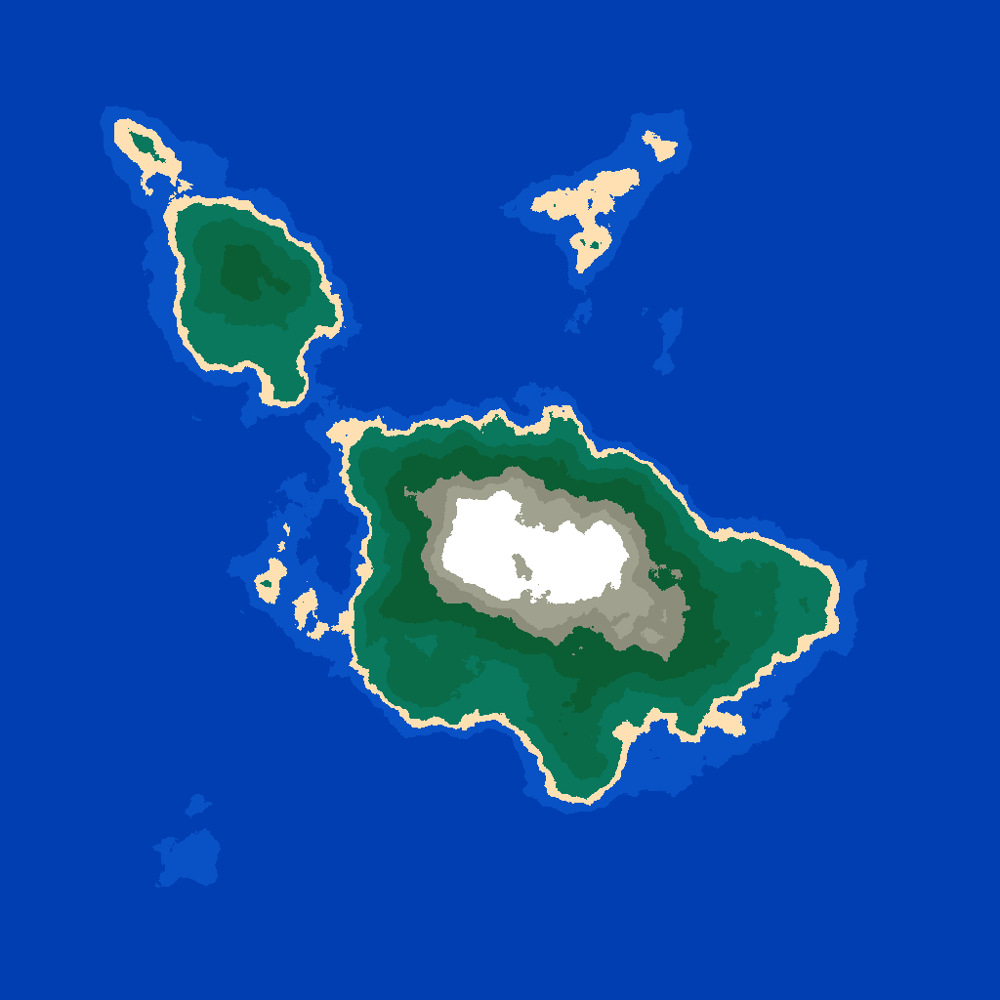
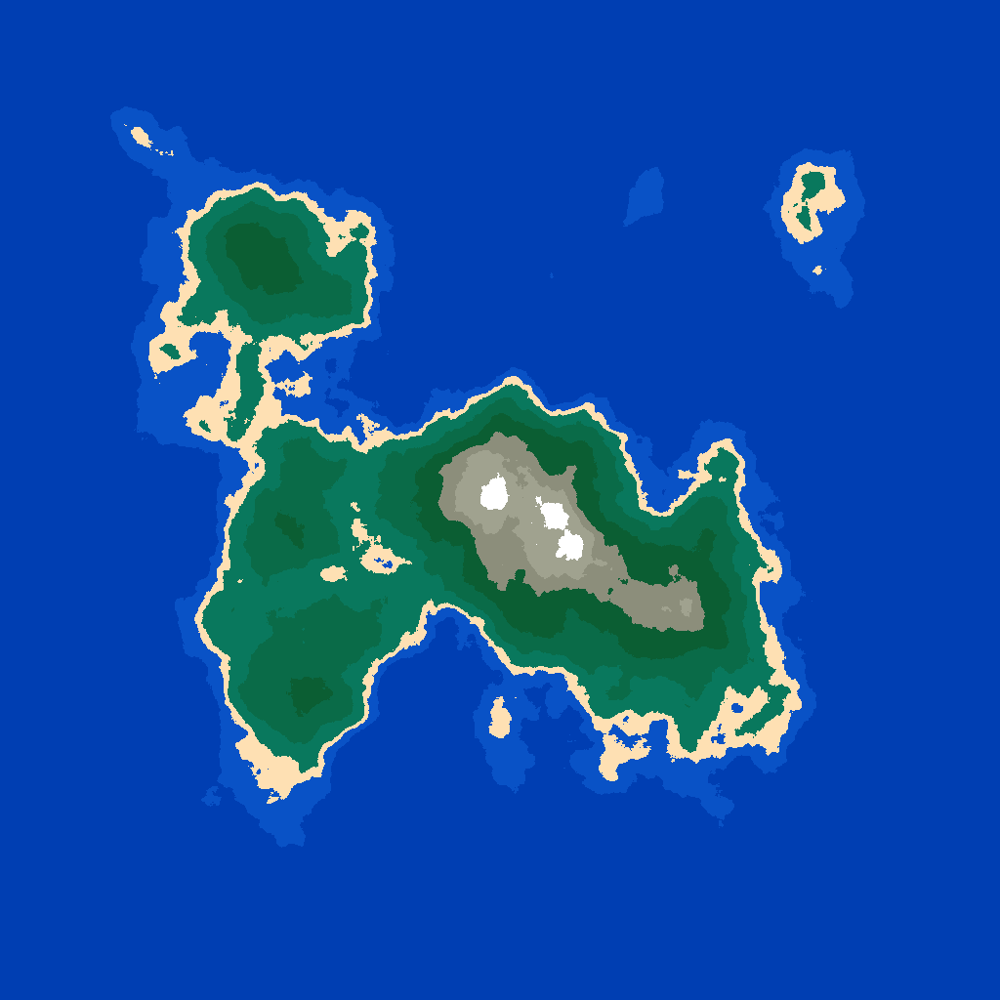
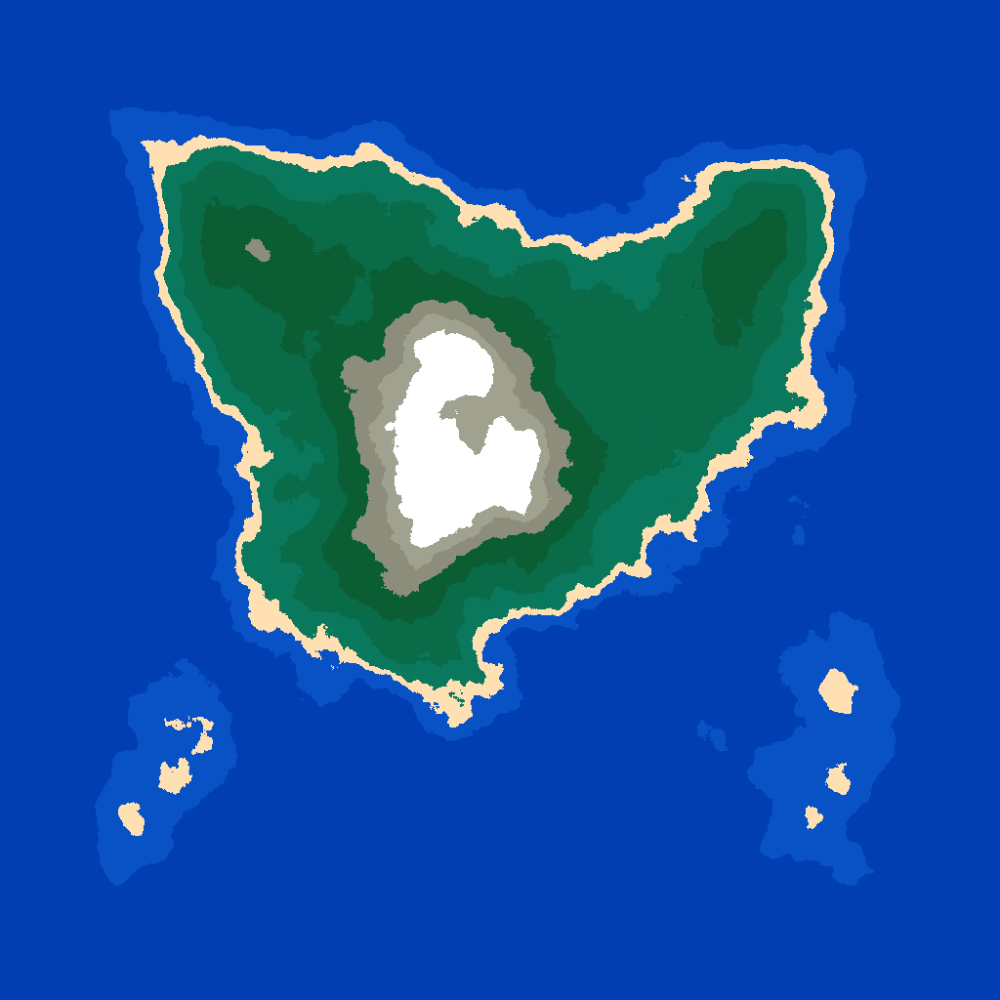

# opensimplex-island-generator

A procedural island map generator written in Python. Given a seed and a handful of noise parameters, it produces a color-mapped PNG that looks like a top-down view of an island.

  

## Description

The generator builds a height map by layering multiple octaves of OpenSimplex noise (fractional Brownian motion). Each octave adds finer detail at a lower amplitude, controlled by the persistence and lacunarity values. The raw noise values sit in [-1, 1] and get normalized to [0, 255].

To make the terrain look like an island rather than an infinite continent, a Chebyshev distance mask is applied. Each pixel's height is multiplied by a falloff factor that drops toward zero at the edges. The `BIAS` parameter controls how fast the falloff occurs: higher values shrink the landmass.

Height values are then bucketed into terrain types and colored accordingly:

| Range | Terrain | Color |
|---|---|---|
| 0-55 | Deep water | (0, 62, 178) |
| 55-80 | Water | (9, 82, 198) |
| 80-110 | Sand | (254, 224, 179) |
| 110-145 | Grass | (9, 120, 93) |
| 145-175 | Dark grass | (10, 107, 72) |
| 175-200 | Dense grass | (11, 94, 51) |
| 200-220 | Dark rock | (140, 142, 123) |
| 220-240 | Rock | (160, 162, 143) |
| 240-255 | Snow | (255, 255, 255) |

## Usage

```python
from generator import generateMap

generateMap(
    height=256,
    width=256,
    seed=291365921,
    scale=64,        # higher = zoomed out noise
    octaves=11,      # more octaves = more detail
    bias=10,         # higher = smaller island
    persistance=0.5, # amplitude decay per octave
    lacunarity=2,    # frequency multiplier per octave
    name="my_map"    # output filename (saves as my_map.png)
)
```

The script prints progress and saves the result as `{name}.png` in the working directory.

To find a seed with mountains near the center of the map:

```python
from generator import findGoodSeed

seed = findGoodSeed(startingSeed=0, numberOfSeeds=100)
```

This searches through seeds and returns one where the highest point falls close to the center.

## Parameters

| parameter | default | effect |
|---|---|---|
| `WIDTH`, `HEIGHT` | 256 | output dimensions in pixels |
| `SCALE` | `max(W, H) / 4` | noise frequency; lower = larger features |
| `OCTAVES` | 11 | number of noise layers; higher = more terrain detail |
| `PERSISTANCE` | 0.5 | how much each octave contributes; lower = smoother |
| `LACUNARITY` | 2 | frequency multiplier per octave; higher = finer detail |
| `BIAS` | 10 | island mask strength; higher = smaller landmass |
| `SEED` | random | controls the noise pattern; same seed = same map |

## Installation

```bash
pip install opensimplex numpy Pillow
```

## License

MIT
