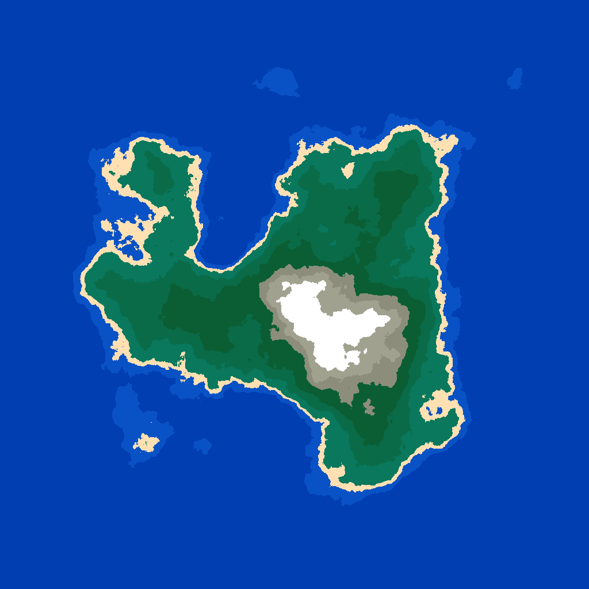

# OpenSimplexNoise Island Generator
Island Generator Algorithm implemented using SimplexNoise and Python.

## How to run
1. Either fork or download the repository
2. Install OpenSimplexNoise dependency using `npm i` command
3. Run the program

## How does it generate land
1. Creates a matrix of the specified size
2. For each position in the matrix call the noise function to get a value
3. The noise function parameters are modified according to custom variables (frequency and octaves)
4. To create the island effect, it applies a mask to reduce values near the edge
5. Finally, each variable is mapped according to a color table and saved as an image

## Customisation
- `WIDTH` and `HEIGTH` of the map
- `OCTAVES` represents the 'quality' of the map (the higher the octaves the more detailed the map will be)
- `PERSISTANCE` and `LACUNARITY` are used to calculate the frequency and the edginess of the map
- `BIAS` is applied to the mask (a higher bias will result in a smaller island)
- `SEED` is usually random but can be custom

## Examples
Below you can find some of the examples and their corresponding seeds. You can find more in the *examples* folder.
- **Seed 1039**

- **Seed 1063**

- **Seed 621**

